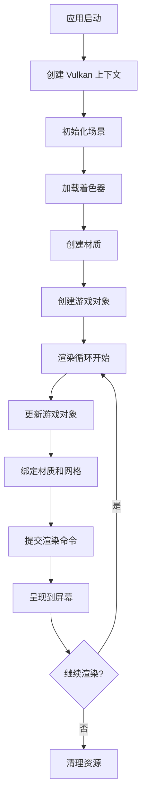

# vulkan-3

一个基于 Vulkan API 的现代 3D 渲染引擎，采用 C++ 开发，提供完整的游戏对象管理、材质系统、着色器管理和资源分配功能。

## 🚀 特性

- **现代 Vulkan 渲染管线**：基于 Vulkan 1.3 API 构建的高性能渲染系统
- **组件化游戏对象系统**：灵活的 GameObject-Component 架构
- **智能资源管理**：自动内存分配和描述符池管理
- **材质和着色器系统**：支持动态材质创建和着色器热重载
- **场景管理**：完整的场景图和相机系统
- **跨平台支持**：基于 SDL3 的窗口管理

## 📁 项目结构

```
vulkan-3/
├── Src/                    # 源代码目录
│   ├── GameObject/         # 游戏对象相关
│   │   ├── GameObject.hpp  # 基础游戏对象和组件系统
│   │   ├── Scene.hpp       # 场景管理
│   │   ├── Camera.hpp      # 相机系统
│   │   ├── Material.hpp    # 材质系统
│   │   ├── Shader.hpp      # 着色器管理
│   │   ├── Pipeline.hpp    # 渲染管线
│   │   └── Mesh.hpp        # 网格数据
│   ├── utils/              # 工具类
│   │   ├── DescriptorPool.hpp  # 描述符池管理
│   │   ├── CommandPool.hpp     # 命令池
│   │   ├── Buffer.hpp          # 缓冲区封装
│   │   ├── Image.hpp           # 图像处理
│   │   └── Resource/           # 资源管理
│   │       ├── Allocation.hpp  # 内存分配器
│   │       └── Resource.hpp    # 资源管理器
│   ├── Contaxt.hpp         # Vulkan 上下文管理
│   ├── Render.hpp          # 渲染器
│   └── Main.cpp            # 程序入口
├── Resources/              # 资源文件
│   └── shaders/           # 着色器源码
├── Thirdparty/            # 第三方库
│   ├── Include/           # 头文件
│   ├── Lib/              # 静态库
│   └── Bin/              # 动态库
└── build/                 # 构建输出目录
```

## 🛠️ 构建要求

### 系统要求
- **操作系统**：Windows 10/11, Linux, macOS
- **编译器**：支持 C++17 的编译器 (MSVC 2019+, GCC 9+, Clang 10+)
- **CMake**：3.16 或更高版本
- **Vulkan SDK**：1.3 或更高版本

### 依赖库
- **Vulkan SDK**：核心图形 API
- **SDL3**：窗口管理和输入处理
- **GLM**：数学库（矩阵和向量运算）
- **vulkan-hpp**：Vulkan 的 C++ 绑定

## 🔧 构建步骤

### Windows (Visual Studio)

```bash
# 克隆项目
git clone https://github.com/your-username/vulkan-3.git
cd vulkan-3

# 创建构建目录
mkdir build
cd build

# 生成 Visual Studio 项目
cmake .. -G "Visual Studio 17 2022"

# 编译项目
cmake --build . --config Release
```

### Linux/macOS

```bash
# 克隆项目
git clone https://github.com/your-username/vulkan-3.git
cd vulkan-3

# 创建构建目录
mkdir build
cd build

# 配置和编译
cmake .. -DCMAKE_BUILD_TYPE=Release
make -j$(nproc)
```

## 🎮 使用示例

### 基本渲染循环

```cpp
#include "Contaxt.hpp"

int main() {
    // 创建渲染上下文
    CT::ContaxtCreateInfo createinfo;
    createinfo.setHeght(980)
        .setWidgh(1080)
        .setWindowName("Vulkan Window");

    CT::Contaxt context(createinfo);

    // 开始渲染循环
    context.Render();

    return 0;
}
```

### 创建游戏对象

```cpp
// 创建游戏对象
auto gameObject = std::make_shared<GM::GameObject>();
gameObject->name = "MyObject";

// 设置变换
gameObject->transform.position = glm::vec3(0.0f, 0.0f, -5.0f);
gameObject->transform.scale = glm::vec3(1.0f);

// 添加组件
auto meshComponent = gameObject->addComponent<MeshComponent>();
auto materialComponent = gameObject->addComponent<MaterialComponent>();
```

### 材质和着色器

```cpp
// 创建着色器
GM::ShaderCreateInfo shaderInfo;
shaderInfo.setDevice(device)
    .addShaderStage("Resources/shaders/shader.vert", vk::ShaderStageFlagBits::eVertex)
    .addShaderStage("Resources/shaders/shader.frag", vk::ShaderStageFlagBits::eFragment);

auto shader = shaderManager.loadShader(shaderInfo);

// 创建材质
auto material = materialManager.createMaterial(shader);
auto materialInstance = std::make_shared<GM::MaterialInstance>();
materialInstance->parent = material;
```

## 🏗️ 架构设计

### 核心组件

#### 1. **Vulkan 上下文管理 (Contaxt)**
- 负责 Vulkan 实例、设备、交换链的创建和管理
- 提供统一的渲染上下文接口
- 处理窗口事件和表面管理

#### 2. **游戏对象系统 (GameObject)**
- **GameObject**：场景中的基本实体，支持层次结构
- **Component**：可复用的功能模块，采用组合模式
- **Transform**：处理位置、旋转、缩放变换

#### 3. **渲染系统**
- **Render**：主渲染器，管理渲染循环和命令缓冲
- **Material**：材质系统，支持多层材质实例
- **Shader**：着色器管理，支持多阶段着色器
- **Pipeline**：图形管线管理

#### 4. **资源管理**
- **DescriptorSetManager**：智能描述符池管理
  - 支持 4 种池类型：General、Shadow、Compute、Tiny
  - 自动池分配和回收
- **Allocator**：统一内存分配器
- **ResourceManager**：缓冲区和图像资源管理

#### 5. **场景管理 (Scene)**
- 集成所有管理器：MaterialManager、ShaderManager、PipelineManager
- 相机系统和视图矩阵管理
- 游戏对象生命周期管理

### 渲染管线流程



## 📚 API 参考

### 主要类接口

#### GameObject
```cpp
class GameObject {
public:
    Transform transform;
    std::string name;

    template<typename T, typename... Args>
    std::shared_ptr<T> addComponent(Args&&... args);

    template<typename T>
    std::shared_ptr<T> getComponent();

    void addChild(const std::shared_ptr<GameObject>& child);
    std::shared_ptr<GameObject> parent();
};
```

#### DescriptorSetManager
```cpp
class DescriptorSetManager {
public:
    enum class DescriptorPoolSizeFlagBits {
        eGeneral,  // 通用池
        eShadow,   // 阴影池
        eCompute,  // 计算池
        eTiny      // 小型池
    };

    void init();
    void destroy();
    DescriptorSetManager& setDevice(const vk::Device& device);
    std::vector<vk::DescriptorSet> allocateDescriptorSet(
        const std::vector<vk::DescriptorSetLayout>& layouts);
};
```

#### MaterialManager
```cpp
class MaterialManager {
public:
    std::shared_ptr<Material> createMaterial(const std::shared_ptr<Shader>& shader);
    std::shared_ptr<RHIMaterial> createRHIMaterial(
        const std::shared_ptr<MaterialInstance>& material);
    std::vector<vk::DescriptorSet> createDescriptorSet(
        const std::vector<vk::DescriptorSetLayout>& setlayout);
};
```

## 🔍 调试和性能

### 调试功能
- Vulkan 验证层集成
- 详细的错误日志输出
- 资源泄漏检测

### 性能优化
- 描述符池按用途分类，减少分配开销
- 统一内存分配器，减少内存碎片
- 命令缓冲池化，提高命令录制效率

## 🤝 贡献指南

1. Fork 项目
2. 创建功能分支 (`git checkout -b feature/AmazingFeature`)
3. 提交更改 (`git commit -m 'Add some AmazingFeature'`)
4. 推送到分支 (`git push origin feature/AmazingFeature`)
5. 开启 Pull Request

### 代码规范
- 使用 C++17 标准
- 遵循现有的命名约定
- 添加适当的注释和文档
- 确保代码通过所有测试

## 📄 许可证

本项目采用 MIT 许可证 - 查看 [LICENSE](LICENSE) 文件了解详情。

## 🙏 致谢

- [Vulkan SDK](https://vulkan.lunarg.com/) - 核心图形 API
- [SDL3](https://www.libsdl.org/) - 跨平台窗口管理
- [GLM](https://github.com/g-truc/glm) - OpenGL 数学库
- [vulkan-hpp](https://github.com/KhronosGroup/Vulkan-Hpp) - Vulkan C++ 绑定

## 📞 联系方式

- 项目链接：[https://github.com/moqianw/vulkan-3](https://github.com/moqianw/vulkan-3)
- 问题反馈：[Issues](https://github.com/moqianw/vulkan-3/issues)

---

**注意**：本项目仍在开发中，API 可能会发生变化。建议在生产环境使用前进行充分测试。